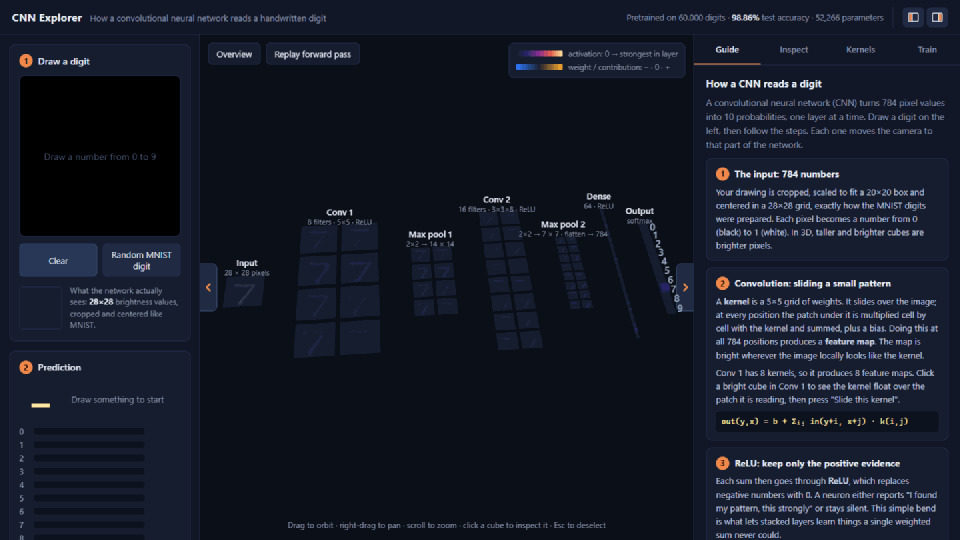
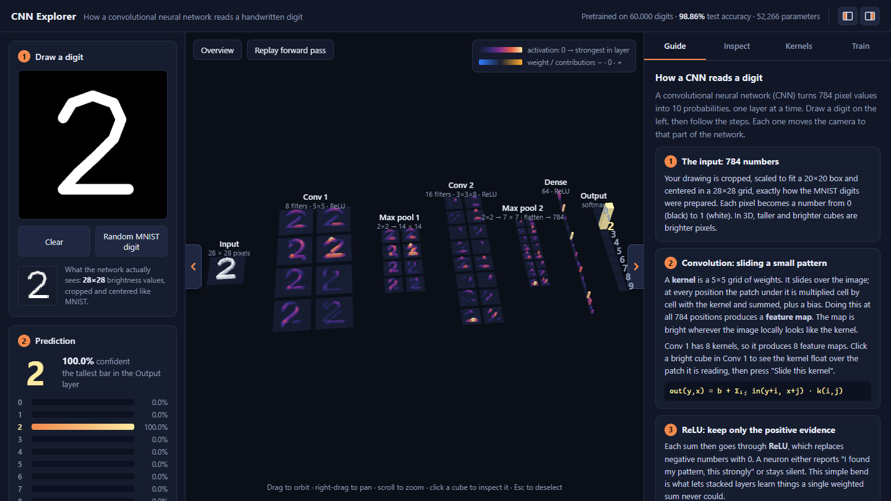
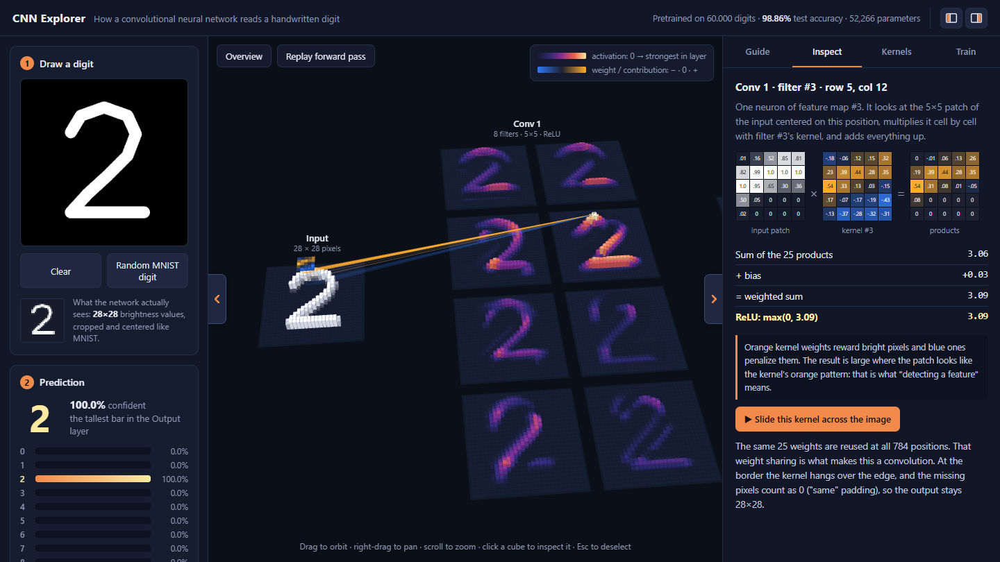
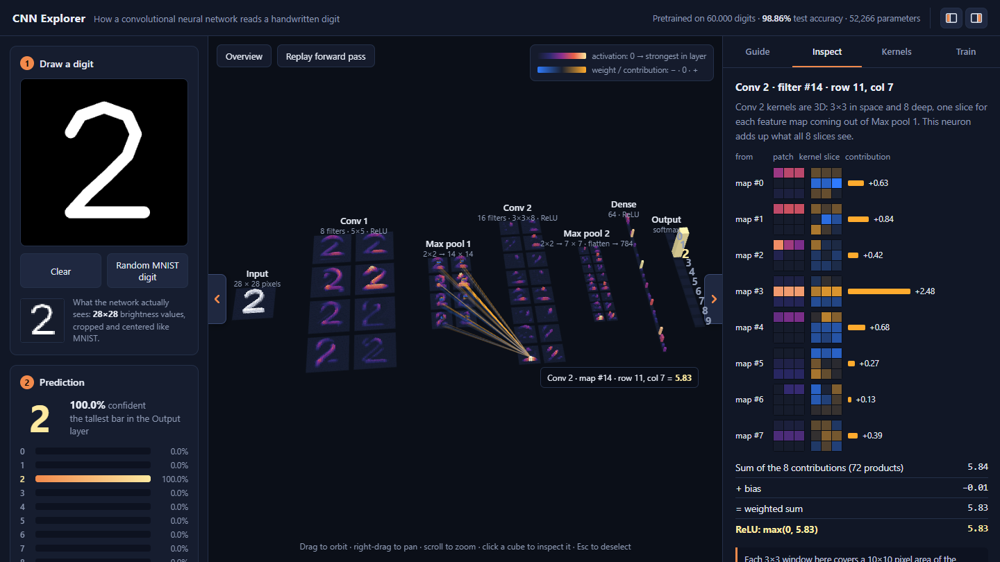
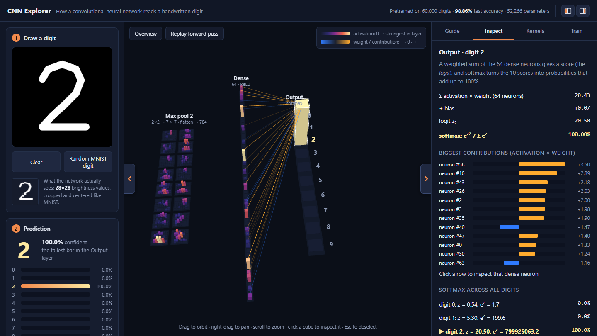
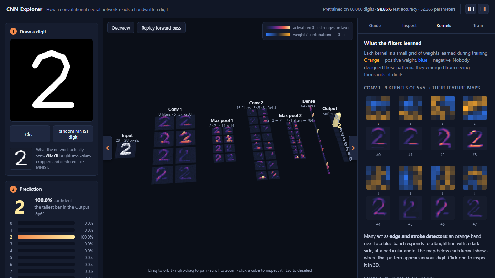
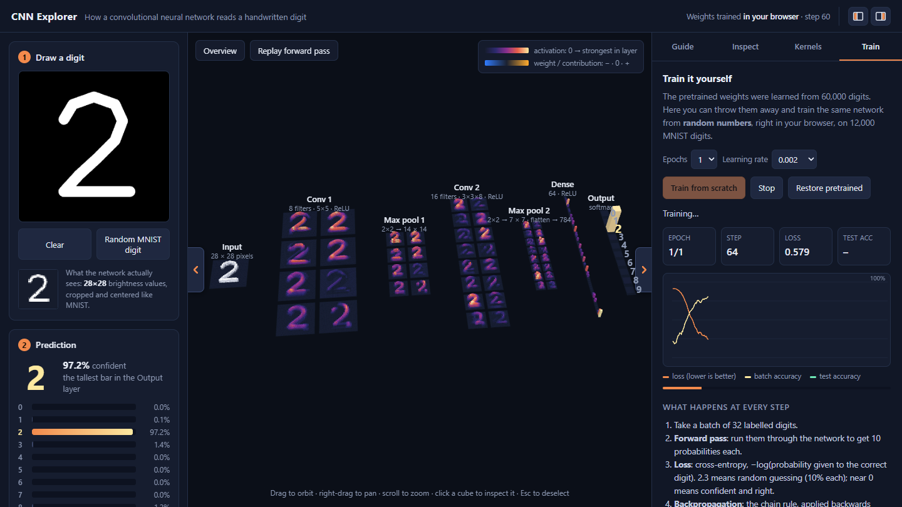
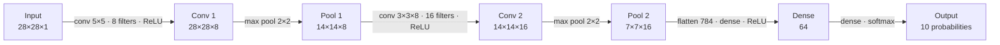

<div align="center">

# CNN Explorer

**See how a convolutional neural network reads handwriting, one neuron at a time, in 3D.**

Draw a digit, watch every layer light up, click any neuron to see the exact math behind it,
then retrain the network in your browser and watch its filters learn.


[](LICENSE)
[](https://github.com/moralesangel/cnn-explorer/actions/workflows/deploy.yml)

### [▶ Try the live demo](https://moralesangel.github.io/cnn-explorer/)

No install needed, it runs entirely in your browser (desktop recommended).



</div>

## Why

CNNs are usually explained with static diagrams of boxes and arrows. This project shows a real,
trained network instead: every cube is an actual neuron, every number in the side panel is the
actual value the network computed for *your* drawing. It is small on purpose (52k weights) so
nothing has to be hidden, and it still gets ~99% of the MNIST test set right.

## What you can do

### Watch every layer react to your drawing

Each neuron is a cube: the taller and brighter, the stronger it fires. Data flows left to right,
from the 28×28 pixels to the 10 output probabilities, and the whole network updates as you draw.



### Click any neuron to see exactly how it was computed

The kernel floats over the patch of the image it is reading, lines show which inputs feed the neuron,
and the side panel works through the real numbers: *patch × kernel = products → sum + bias → ReLU*.
Press **Slide this kernel** to watch the feature map being built position by position.



<table>
  <tr>
    <td width="50%"></td>
    <td width="50%"></td>
  </tr>
  <tr>
    <td><b>Conv 2</b>: its kernels are 3D (3×3×8). See what each of the 8 input maps contributes.</td>
    <td><b>Output</b>: which dense neurons voted for this digit, and how softmax turns scores into probabilities.</td>
  </tr>
</table>

### See what the filters learned

Every kernel next to the feature map it produces for your digit. Nobody designed these patterns:
they emerged from training.



### Train it yourself, from random weights

Reset the network to random numbers and train it on 12,000 MNIST digits with TensorFlow.js on your GPU.
The kernels, the 3D activations and the prediction all update live, next to a loss/accuracy chart.



A **Guide** tab walks through each layer step by step (convolution, ReLU, pooling, flatten, dense, softmax,
training) and moves the camera to the right place as you read.

## The network



| Layer  | Output   | Details                               | Parameters |
|--------|----------|---------------------------------------|-----------:|
| input  | 28×28×1  | pixel brightness, 0 to 1              |          – |
| conv1  | 28×28×8  | 8 kernels 5×5, same padding, ReLU     |        208 |
| pool1  | 14×14×8  | 2×2 max pool                          |          – |
| conv2  | 14×14×16 | 16 kernels 3×3×8, same padding, ReLU  |      1,168 |
| pool2  | 7×7×16   | 2×2 max pool, then flatten to 784     |          – |
| dense1 | 64       | fully connected, ReLU                 |     50,240 |
| dense2 | 10       | fully connected, softmax              |        650 |

**52,266 parameters**, **98.86%** accuracy on the 10,000 MNIST test digits.

## Quick start

```bash
git clone https://github.com/moralesangel/cnn-explorer.git
cd cnn-explorer
npm install
npm run dev          # open http://localhost:5173
```

The pretrained weights (`public/model/weights.json`) and the MNIST subsets the browser uses
(`public/data/`) are included, so that's all you need.

```bash
npm run build        # static site in dist/, works on GitHub Pages or any static host
```

Every push to `main` rebuilds the live demo on GitHub Pages automatically
([`.github/workflows/deploy.yml`](.github/workflows/deploy.yml)).

### Regenerating the data and weights (optional)

```bash
npm run data         # download MNIST and write the browser subsets to public/data/
npm run train        # train with Keras -> public/model/weights.json (needs Python + TensorFlow)
npm run check        # verify the weights with the JavaScript forward pass on all 10,000 test digits
```

`npm run train` runs `python scripts/train.py`, so run it from a Python environment with TensorFlow
(e.g. `conda activate <env> && python scripts/train.py --epochs 8`). Training uses light augmentation
(small shifts, rotations and zooms) so the model copes better with hand-drawn digits.

## How it works

- **Inference is hand-written.** [`src/model/cnn.js`](src/model/cnn.js) is a ~100-line forward pass in
  plain JavaScript, so every intermediate value is available to show. `npm run check` confirms it
  reproduces the Keras accuracy exactly and matches TF.js to within 3×10⁻⁷.
- **3D with [three.js](https://threejs.org).** One `InstancedMesh` per layer, about 12,600 cubes in total.
- **Training with [TensorFlow.js](https://www.tensorflow.org/js)**, loaded only when you press *Train*
  ([`src/train/trainer.js`](src/train/trainer.js)).
- **MNIST-style preprocessing.** Drawings are cropped, scaled to fit 20×20 and centered by center of mass
  in 28×28, exactly how the MNIST digits were prepared ([`src/ui/draw-pad.js`](src/ui/draw-pad.js)).
- **No framework**: plain ES modules bundled with [Vite](https://vite.dev).

<details>
<summary><b>Project structure</b></summary>

```
src/
  main.js               wiring: drawing → forward pass → 3D view + panels
  model/arch.js         the architecture, in one place
  model/cnn.js          hand-written forward pass (used for all visualization)
  model/tf-model.js     the same network in TF.js (for training) + weight import/export
  viz/layout.js         where each neuron sits in 3D
  viz/scene.js          three.js scene: cubes, selection, links, kernel "ghost", camera
  viz/connections.js    which inputs feed a selected neuron, and how much
  viz/colors.js         colormaps
  ui/                   draw pad, prediction bars, inspector, kernels, guide, training panels
  train/trainer.js      in-browser training loop
  data/mnist.js         loads the MNIST sprite PNGs
scripts/
  prepare-data.mjs      MNIST download + browser subsets
  train.py              Keras training → public/model/weights.json
  check-weights.mjs     accuracy check of the JS forward pass
```

In development, `window.cnn` exposes the app state and the forward pass in the browser console.

</details>

## Credits

- [MNIST](https://yann.lecun.com/exdb/mnist/) handwritten digit database, by Yann LeCun, Corinna Cortes
  and Christopher J.C. Burges.
- Inspired by Adam Harley's
  [interactive node-link visualization of CNNs](https://adamharley.com/nn_vis/).
- Built with [three.js](https://threejs.org), [TensorFlow.js](https://www.tensorflow.org/js) and
  [Vite](https://vite.dev).

## License

The code is released under the [MIT License](LICENSE). The MNIST digits in `public/data/` come from the
MNIST database by Yann LeCun, Corinna Cortes and Christopher J.C. Burges, which is distributed under the
[Creative Commons Attribution-Share Alike 3.0](https://creativecommons.org/licenses/by-sa/3.0/) license.
